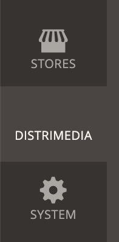
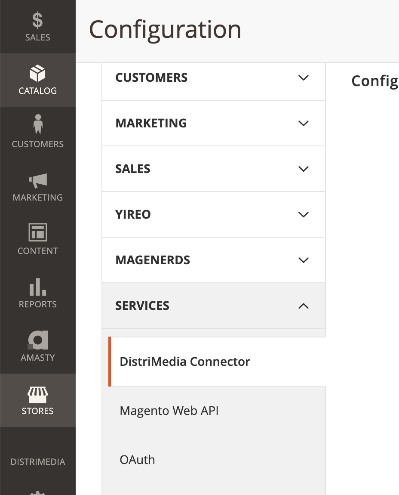
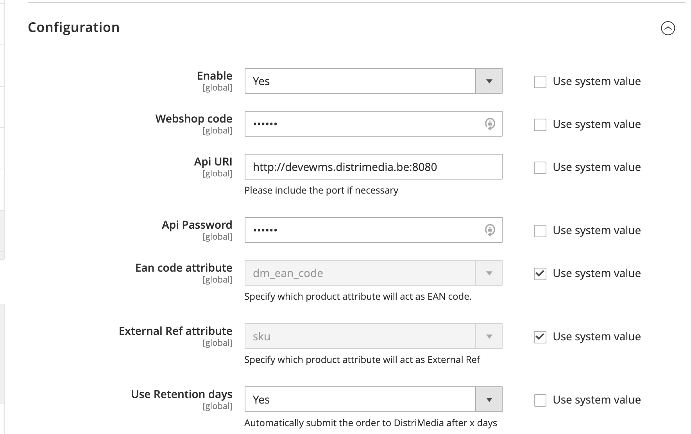
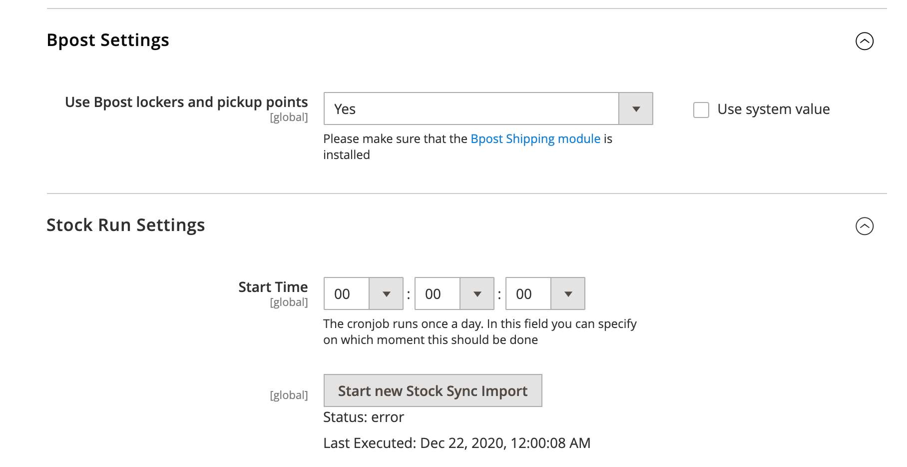

# DistriMedia Connector

## Introduction 

This Magento2 module provides the integration with DistriMedia ERP system and providers following features:
- Synchronisation of orders 
- Synchronisation of stock

## Requirements
For this module to work following requirements are defined:
1. PHP 7.3 or newer
2. Magento Open Source 2.3.5 or newer 
3. Enabled and functional Message queues (product_action_attribute.update):
    - You can check this by executing `ps aux | grep magento` on your server. If you see the following process running, you're all set:
    -   `bin/magento queue:consumers:start product_action_attribute.update --single-thread --max-messages=10000`

## Installation 
1. Use composer package manager to install the module
`composer require baldwin/magento2-distrimedia-connector`
2. Enable the module 
`bin/magento module:enable DistriMedia_Connector`
3. Run upgrade scripts, this also generates an Access Token
`bin/magento setup:upgrade`

## Configuration 
Provide your DistriMedia webshopcode, uri and password in the configuration form.
Please [contact](mailto:orlando.vanhove@distrimedia.be) DistriMedia to receive these credentials
                                                      
You can find these settings in `Stores - Configuration - Services - DistriMedia Connector`

You will also need to create  an [integration](https://devdocs.magento.com/guides/v2.4/get-started/authentication/gs-authentication-token.html) in Magento.
Provide the Access Token to DistriMedia together with the base URL of your shop.

DistriMedia will set-up 2 pushback endpoints which they will use to update individual products and orders:
- Stock pushback endpoint
- Order pushback endpoint

Make sure the access token has the required permissions. (Orders and Stock Integration ACL)
When installing the module, this is done automatically. 

### Bpost Settings
It's possible to integrate with the official [Bpost module](https://marketplace.magento.com/bpost-shipping.html). Enable this option to send the shipping Information to DistriMedia

### Stock Run Settings
Here you can define when the stock cron job will run to update the complete inventory.
You can also manually schedule the cron job. A new task will be added to the execution.

When saving the configuration, always make sure to flush the Magento Config Cache.

## Some screenshots

### Main Menu

### Configuration Menu

### General Configuation

### Cron Configuation

## License
[MIT](https://choosealicense.com/licenses/mit/)
